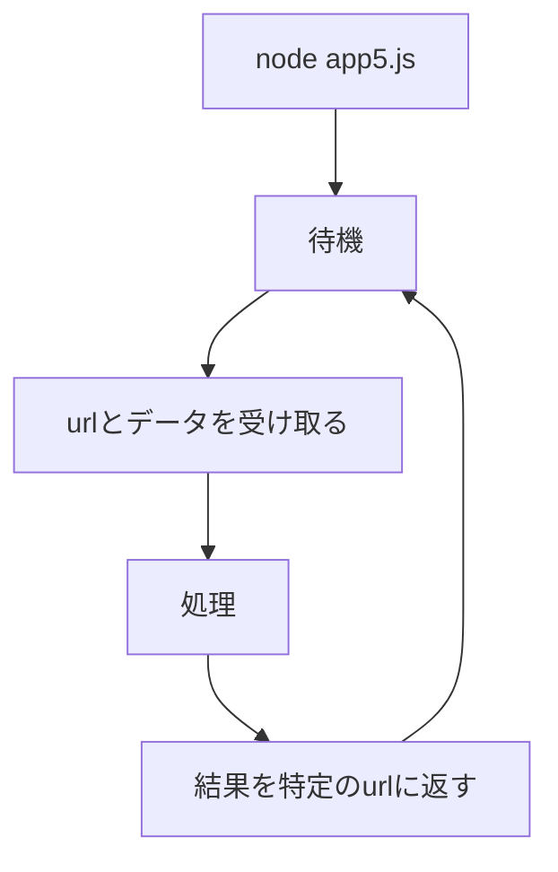

# Webpro_06

## 目次
- このプログラムについて
- じゃんけんの処理に関わるファイル一覧
- 起動方法
- 利用方法
- 編集したファイルをGitにプッシュする方法
- app5.js機能ごとの説明

## app5.jsについて
app5.jsはデータをユーザから受け取り，その結果を処理して表示させる動的なwebページのためのサーバプログラムである，機能としては，じゃんけん，運勢，予想の三つの機能がある．

## じゃんけんに関わるファイル一覧
ファイル| 説明
-|- 
app5.js|サーバプログラム本体
public/janken.html|じゃんけんの開始画面
views/janken.ejs|じゃんけんのテンプレートファイル
views/luck.ejs|運勢のテンプレートファイル
views/prediction.ejs|ジャンケン予想のテンプレートファイル


## 起動方法
1. webpro_06のディレクトリで```node app5.js```をターミナルで実行し，app5.jsを起動する(```command+c```で停止)
1. Webブラウザで[localhost:8080/public/janken.html](http://localhost:8080/public/janken.html)を打ち込む

## 利用方法
ジャンケンの方法
-  グーチョキパーのボタンを選んで```ジャンケン　ポン```ボタンを押す．
-  2度目以降は，追加で勝利数と総試合数が表示され，じゃんけんをすることができる．

運勢ページを表示させる方法
-  ```運勢```ボタンを押すと，大吉から大凶をランダムで表される．このページの```じゃんけんへ```ボタンを押すとじゃんけんへ戻れる.

予想ページを表示させる方法
-  ```予想```ボタンを押したら，勝率から勝つか負けるかをランダムで予想し，その結果を表示させる．運勢ページと同様に```じゃんけんへ```ボタンを押すことでじゃんけんへ戻れる．

## 編集したファイルをGitにプッシュする方法
1. 変更したファイルを保存する
1. webpro_06ファイルのディレクトリに移動する
1. ターミナルに以下のコマンドを打ち込む
 ```git add .```
 ```git commit -am '変更内容'```
 ```git push```
## app5.js機能ごとの説明
### app5.js
このプログラムはサーバとしての機能を持っている．janken.htmlや他のejsファイルからデータと処理するエンドポイントを受け取り，その結果をejsファイルに送信して動的に表示できるようになっている．


### じゃんけん機能
-  受け取るurlとデータ
htmlやejsファイルのform action="/janken"でデータを受けとり，app.get("/janken",...で処理される.
自分の手であるhand，勝利数win，総試合数totalを受け取る.

-  処理する内容
cpuの手をランダムで決め，それによるジャンケンの勝敗をjadgementに入れる.

-  送信データ
hand，cpu，win，total，judgement

-  送信先
janken.ejs
### 運勢機能
-  受け取るurl
form action="/luck"で受け取り，app.get("/luck",...で処理される.

-  処理する内容
1から6の数字をランダムで決め，それに応じた大凶などの運勢の結果をluckとする．

-  送信データ
number，luck，hand，win，total

-  送信先
luck.ejs
### 予想機能
-  受け取るurlとデータ
form action="/prediction"で受けとり，app.get("./prediction",...で処理される.
勝利数win，総試合数totalを受け取る.

-  処理する内容
win/total x 100で勝率rateを算出する.
1から100までの値をnumに代入し，rateとnumの数字の大きさを比べ，予想judgeが勝ち，負けのどちらかを決める.

-  送信データ
hand，win，total，judge，rate

-  送信先
janken.ejs