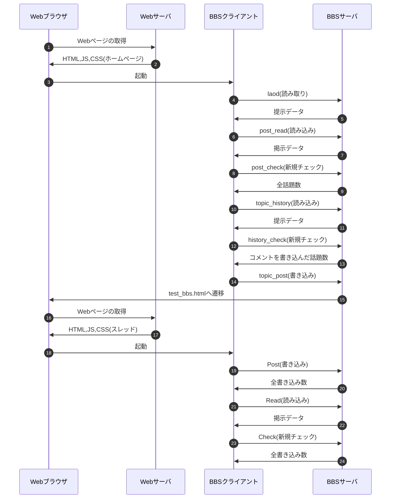

```mermaid
sequenceDiagram
  autonumber
  Webブラウザ ->> Webサーバ: Webページの取得
  Webサーバ ->> Webブラウザ:HTML,JS,CSS(ホームページ)
  Webブラウザ ->> BBSクライアント:起動
  BBSクライアント ->> BBSサーバ:laod(読み取り)
  BBSサーバ ->> BBSクライアント:提示データ
  BBSクライアント ->> BBSサーバ:post_read(読み込み)
  BBSサーバ ->> BBSクライアント:掲示データ
  BBSクライアント ->> BBSサーバ:post_check(新規チェック)
  BBSサーバ ->> BBSクライアント:全話題数
  BBSクライアント ->> BBSサーバ:topic_history(読み込み)
  BBSサーバ ->> BBSクライアント:提示データ
  BBSクライアント ->> BBSサーバ:history_check(新規チェック)
  BBSサーバ ->> BBSクライアント:コメントを書き込んだ話題数
  BBSクライアント ->> BBSサーバ:topic_post(書き込み)
  BBSサーバ ->> Webブラウザ:test_bbs.htmlへ遷移
  Webブラウザ ->> Webサーバ: Webページの取得
  Webサーバ ->> Webブラウザ:HTML,JS,CSS(スレッド)
  Webブラウザ ->> BBSクライアント:起動
  BBSクライアント ->> BBSサーバ:Post(書き込み)
  BBSサーバ ->> BBSクライアント:全書き込み数
  BBSクライアント ->> BBSサーバ:Read(読み込み)
  BBSサーバ ->> BBSクライアント:掲示データ
  BBSクライアント ->> BBSサーバ:Check(新規チェック)
  BBSサーバ ->> BBSクライアント:全書き込み数
```